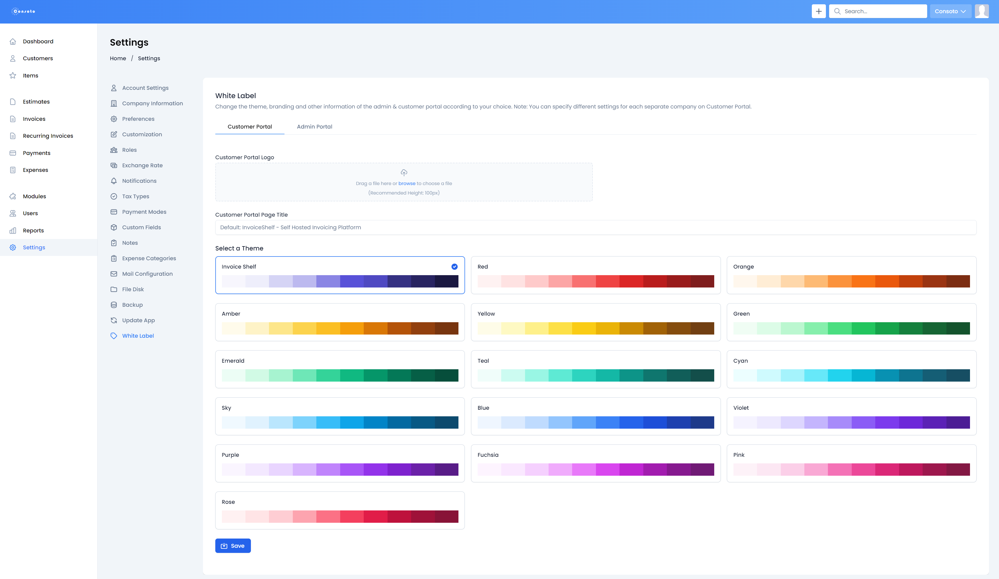

# Invoice Shelf - White Label Module

Adds ability to customise your InvoiceShelf instance with logo and brand color.

> [!IMPORTANT]
> This module is for **InvoiceShelf 2.x only**. On 2.3.0 and later it needs version 1.1.4 or newer;
> 1.1.3 and older show a blank settings page there. It does not run on InvoiceShelf 3.x.

## Table of Contents

- [Invoice Shelf - White Label Module](#invoice-shelf---white-label-module)
  - [Table of Contents](#table-of-contents)
  - [Compatibility](#compatibility)
  - [Installation](#installation)
  - [Update](#update)
    - [Hard Stops](#hard-stops)
  - [Development](#development)
    - [Prerequisites](#prerequisites)
    - [Steps](#steps)
  - [Troubleshooting](#troubleshooting)
  - [Copyright](#copyright)

## Compatibility

| InvoiceShelf | White Label module |
| --- | --- |
| 2.3.0 and later | 1.1.4 or newer |
| 1.3.0 to 2.2.x | 1.1.0 to 1.1.3 |
| 3.x | not supported |

## Installation

1. Download the zip with pre-built module from the [latest release](https://github.com/InvoiceShelf/module-whitelabel/releases/latest) in this repo. Alternatively you can build from source, for that follow the steps in the [development](#development) section.
2. Create `/Modules/` dir in your server InvoiceShelf project root. **NOTE:** make sure it's capitalised like in example, it's not a typo.
3. Upload the `WhiteLabel.zip` into the newly created `/Modules/` dir.
4. Unzip it.
5. In your server InvoiceShelf project `/` root dir, run `php artisan install:module WhiteLabel <semantic release version>` e.g. `php artisan install:module WhiteLabel 1.1.5`, please consult with `package.json` for correct release version number inside the release artifact.
6. Run `php artisan optimize:clear`, or restart the container if you run InvoiceShelf in Docker. The
   Docker image caches its routes when it starts, so the module's pages return 404 until then.
7. (optional) If you have any issues with your installed module, try clearing your browser's `cache`, `cookies`, and/or `site data`.

## Update

1. Download the zip with pre-built module from the [latest release](https://github.com/InvoiceShelf/module-whitelabel/releases/latest) in this repo. Alternatively you can build from source, for that follow the steps in the [development](#development) section.
2. Upload the `WhiteLabel.zip` into the `/Modules/` dir.
3. Remove the old `WhiteLabel/` module folder.
4. Unzip it, run `php artisan optimize:clear` (or restart the container in Docker) and visit the site.

### Hard Stops

- InvoiceShelf >= 1.3.0 (upgrade this module to 1.1.0)
- InvoiceShelf >= 2.3.0 (upgrade this module to 1.1.4)

## Development

This is a step by step guide on how to get started, with development.

### Prerequisites

1. nvm/fnm (optional)
2. Node JS: `24` (what InvoiceShelf 2.x requires)
3. `pnpm` for InvoiceShelf and `yarn` for this module

### Steps

1. Clone the [InvoiceShelf repo](https://github.com/InvoiceShelf/InvoiceShelf) and check out the `2.x` branch - needed for the admin components. In the future it's likely to be just a node package and you wont need this step.
2. Create `Modules/` dir, in the root dir.
3. Clone this repo into `WhiteLabel/` dir inside `/Modules/`.
4. Initialise `node_modules` by running `pnpm install` inside `/` of the InvoiceShelf repo.
5. Initialise `node_modules` by running `yarn` inside `/Modules/WhiteLabel/` of this repo.
6. Make the changes you wish to make.
7. Run `yarn build`, new `/Modules/WhiteLabel/dist/` dir will be created with built `css` and `js` bundles.
8. Upload the contents of `/Modules/WhiteLabel/` to your server with InvoiceShelf. Either use SFTP or zip up the folder.
9. Continue from [Installation (Step 2)](#installation)

## Troubleshooting

- If your uploaded logo isn't showing up or uploading you may need to again fix the `/storage/` permissions by running `chmod -R 775 storage`.
- If can't see a save button you need to clear your `cache`, `cookies`, and/or `site data` as specified in [Installation (Step 6)](#installation)

## Copyright

    Copyright (C) 2022-2023 <Nicolas Widart> n.widart@gmail.com
    Copyright (C) 2024-2026 <Rihards Simanovics> rihards.s@griffin-web.studio
